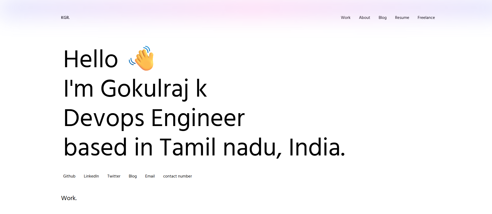

# React Portfolio & Blog – Modern Next.js Template

A production-ready, fully-editable portfolio and blog system built with Next.js, Tailwind CSS, and modern UI/UX best practices. Features a secure edit dashboard, instant content updates, a robust freelance section, animated welcome card, feedback form, and mobile/desktop responsive design.

---

## ✨ Features

- **Instantly Editable Content:**
  - Edit portfolio, resume, blog posts, freelance gigs, and welcome card from a secure `/edit` page.
  - All changes are saved to the filesystem and reflected instantly across the site.

- **Freelance System:**
  - Showcase freelance gigs and services with interactive cards and dropdowns.
  - All freelance and service data is managed from the `/edit` dashboard.

- **Modern UI/UX:**
  - Animated, editable welcome card (main page, first load only).
  - Custom cursor (desktop only, robust and non-duplicating).
  - Smooth anchor navigation and responsive layouts.
  - Footer feedback card perfectly aligned with the heading on desktop, stacked on mobile.
  - "Contact Number" button opens the phone dialer directly.

- **Feedback System:**
  - Feedback form with name, designation, email, and spam protection (honeypot, math captcha, rate limiting).
  - Feedback is sent to your configured email address.

- **Dark/Light Mode:**
  - Fully supports system and manual theme switching, including on iPhone/Safari.
  - Mobile menu now updates instantly when toggling dark/light mode.

- **Production-Ready Docker:**
  - Optimized Dockerfile and `.dockerignore` for small, secure production images.

---

## 🚀 Getting Started

### 1. Clone the Repository
```bash
git clone https://github.com/yourusername/react-portfolio-template.git
cd react-portfolio-template
```

### 2. Install Dependencies
```bash
npm install
```

### 3. Configure Environment Variables
Create a `.env.local` file in the root directory:
```
ADMIN_PASSWORD=your_admin_password
GMAIL_USER=your_gmail_address
GMAIL_PASS=your_gmail_app_password
FEEDBACK_EMAIL=your_feedback_email
```

### 4. Run Locally
```bash
npm run dev
```
Visit [http://localhost:3000](http://localhost:3000)

### 5. Build & Run with Docker
```bash
docker build -t react-portfolio .
docker run -p 3000:3000 react-portfolio
```

---

## 🛠 Editing Content
- Go to `/edit` (admin password required) to update portfolio, resume, blog, freelance gigs, and welcome card.
- All changes are saved to the filesystem and reflected instantly.

---

## 📁 Project Structure
- `pages/` – Next.js pages (main, blog, freelance, edit, API routes)
- `components/` – All UI components (Header, Footer, FeedbackForm, etc.)
- `data/portfolio.json` – Main data file for portfolio, services, contact, etc.
- `_posts/` – Markdown blog posts
- `public/` – Static assets (images, resume, favicon)
- `styles/` – Tailwind and global CSS

---

## 📦 Deployment
- Deploy anywhere that supports Node.js (Vercel, Netlify, DigitalOcean, etc.)
- For Docker, use the provided Dockerfile for a production build.

---

## 🙏 Credits
- Built with [Next.js](https://nextjs.org/), [Tailwind CSS](https://tailwindcss.com/), and [React](https://react.dev/).
- Inspired by modern developer portfolio best practices.

---

## 📄 License
MIT


